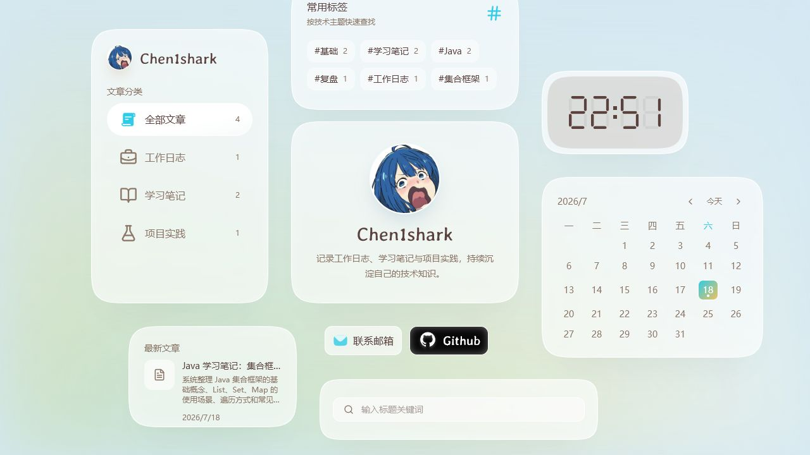
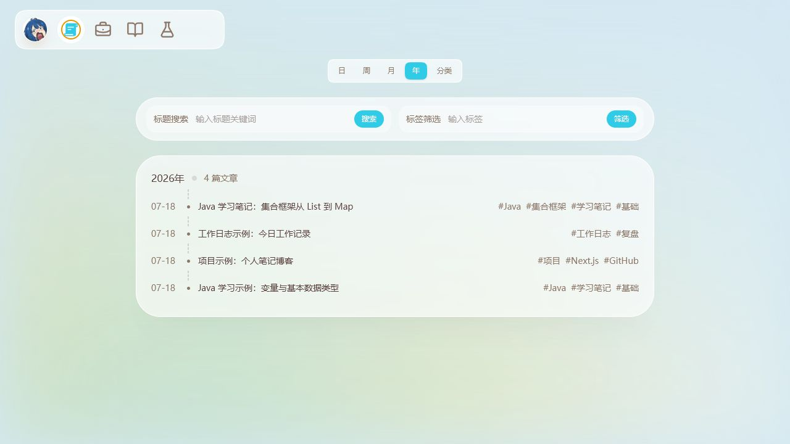
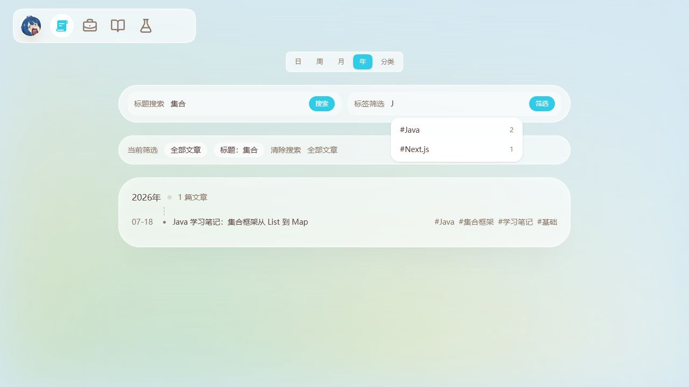
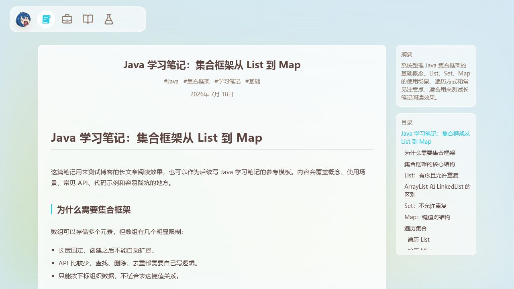
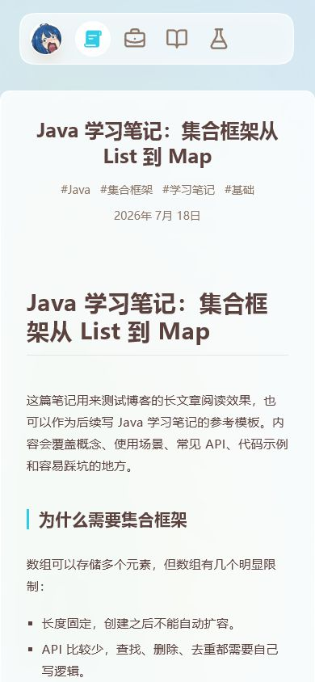
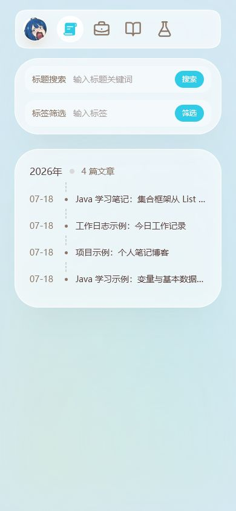
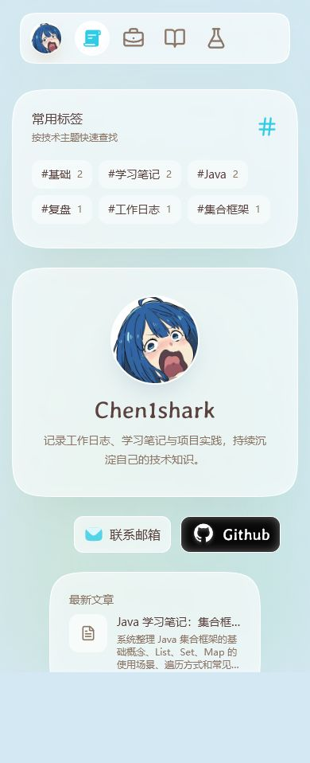
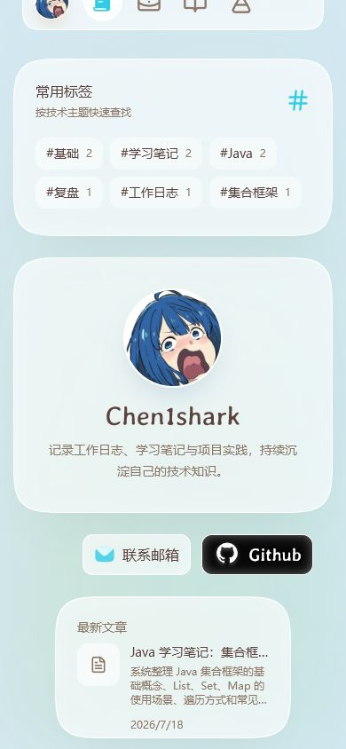

# Chen1shark 技术博客全面审核

审核日期：2026-07-18  
审核范围：首页发现内容 → 分类、标题与标签筛选 → 长文章阅读 → 窄屏适配 → 构建与部署准备。  
本次只创建审核报告和截图，没有修改产品代码或内容。

## 总体结论

当前博客已经具备稳定的核心阅读流程，视觉风格也有辨识度，不建议推翻重做。分类、常用标签、标题搜索、标签筛选、日历按日查看和长文章目录已经形成一套完整的技术笔记入口。

上线前建议优先处理“模板残留、部署方式、SEO 与无障碍”四类问题。视觉层面只需局部调整。

## 审核步骤

### 1. 首页发现内容——总体良好，常见矮屏有裁切

优点：

- 文章分类、常用标签、个人介绍、最新文章、日历和标题搜索各自职责清楚。
- 分类数字、标签数字和日历文章标记都能帮助快速判断内容量。
- 视觉语言统一，保留当前卡片布局是合理的。

问题：

- 在 1280×720 下，“常用标签”卡片顶部超出视口约 26px。原因是桌面卡片按视口中心绝对定位，卡片总高度没有针对矮屏收缩。
- 最新文章卡只有 266×160，标题和摘要同时出现时信息过密。建议保留标题与日期，摘要缩短为 1—2 行，或者稍微加宽卡片。
- 首页头像源文件约 1.09MB，却只以约 40—112px 展示。应生成 256×256 的 WebP/AVIF，目标小于 100KB。

### 2. 文章检索与筛选——功能完整，交互语义需整理

优点：

- 标题搜索、标签筛选、分类、日期可以组合使用。
- 标签建议层级正确，没有再与文章列表重叠。
- 窄屏会隐藏标签并截断长标题，没有横向溢出。

问题：

- 整篇文章是一个链接，内部标签又被实现为 `role="link"` 的可交互元素，形成交互元素嵌套。鼠标可用，但键盘和读屏器语义不稳。建议把文章标题链接与标签链接改为同级元素。
- 手动提交标签时使用大小写精确匹配。输入 `java` 会与现有 `Java` 不匹配；应做大小写无关匹配，或提交前映射到已有标签的标准写法。
- 筛选状态中“全部文章”同时作为当前范围和重置入口出现，容易重复理解。建议将最后一个入口改为“清除全部筛选”。
- 输入框移除了默认焦点轮廓，但没有统一的 `focus-visible` 样式，键盘用户难以判断焦点位置。

### 3. 长文章阅读——正文体验可用，页面元信息是主要短板

优点：

- 标题层级、表格、代码块、复制按钮、摘要和目录都能正确渲染。
- 正文宽度、行高和章节层次适合技术笔记。
- 长文目录固定在右侧，阅读定位方便。

问题：

- 页面顶部标题与 Markdown 的 H1 重复。桌面端尚可接受，移动端会明显占用首屏。建议只保留一个 H1；顶部区域可保留标签与日期。
- 文章路由是纯客户端加载，浏览器标题仍是通用的 `Chen1shark`，没有每篇文章独立的 title、description、Open Graph 与 canonical。技术博客的搜索引擎收录和分享预览会受到影响。
- 无效文章地址返回客户端错误文字而不是正式 404 状态，也没有返回文章列表的入口。
- 目录和摘要视觉在正文右侧，但 DOM 阅读顺序位于正文之后。读屏器无法先利用目录导航。
- 代码复制按钮默认 `opacity: 0`，只在鼠标 hover 时显示；应同时支持 `:focus-visible`。

### 4. 窄屏阅读——整体可用，可再提高首屏效率

优点：

- 390px 宽度下没有横向溢出。
- 首页能够向下滚动，最新文章完整可达。
- 文章列表搜索栏自动改为上下排列，正文表格和代码区保持在页面宽度内。

问题：

- 文章页重复标题在移动端占用较多首屏空间。
- 首页移动端隐藏了标题搜索、日历和时钟。隐藏时钟与日历合理，但建议把标题搜索保留在个人介绍下方，减少“先进入列表再搜索”的一步。
- 移动导航只有图标，当前链接缺少可访问名称，实际点击区域多为 28×28px。建议添加 `aria-label`，并把触摸目标扩到至少约 44×44px。

## 上线前的结构与部署问题

### P0：建议部署前处理

1. **清除原模板的数据归属。** 当前仍加载原作者的 Google Analytics ID `G-ZNSFR7C9PM`，RSS 默认域名仍是 `https://www.yysuni.com`，README、GitHub 默认仓库名与 Wrangler 名称也保留原模板内容。应统一搜索并替换或删除 `yysuni`、`2025-blog-public`、`G-ZNSFR7C9PM`。
2. **明确部署目标。** `pnpm build` 产物显示 `/blog/[id]` 是动态服务端路由，不能直接作为纯 GitHub Pages 静态站点发布。现有代码更接近 Cloudflare Workers 方案；如果坚持 GitHub Pages，需要静态导出、静态参数生成以及去除服务端重定向等改造。
3. **修正站点 URL。** sitemap 使用 `SITE_URL`，RSS 使用 `NEXT_PUBLIC_SITE_URL`，默认值分别是 `localhost:3000` 和原作者域名。本次构建已经生成了指向 `localhost:3000` 的 sitemap。建议统一为一个正式的 `SITE_URL` 配置，并在无配置时让构建失败而不是静默回退。

### P1：建议尽快处理

1. **彻底删除前端编辑与密钥逻辑。** 写文章按钮虽已隐藏，但文章列表仍包含 PEM 文件输入、认证状态、分类编辑、保存和 GitHub 写入代码；`/snippets` 也仍能进入编辑功能。用户已经决定只从代码层面维护，这些逻辑应该真正移除。
2. **删除无关公开页面。** 当前构建仍发布 `/image-toolbox`、`/snippets`、`/svgs`、`/wuthering-waves`。其中游戏与工具页面不属于纯技术博客。`/clock` 与首页时钟有关，可以保留。
3. **移除全局加密负担。** `useBlogIndex()` 因隐藏文章逻辑依赖认证模块，导致 jsrsasign 相关的 338,280 字节原始 JS（gzip 约 89,665 字节）进入全局布局资源。删除认证依赖后，所有页面都会更轻。
4. **完善基础无障碍。** 将 `html lang="en"` 改为 `zh-CN`；删除 `user-scalable=no`；为导航图标补充名称；增加统一的 `focus-visible`；为动画增加 `prefers-reduced-motion` 处理。
5. **调整交互色。** 品牌色 `#2fcbe7` 与白色对比度约 1.94:1，不适合白字按钮或白底小字。可以保留它做装饰，再增加一个更深的 action/text 品牌色。

### P2：内容和维护体验优化

1. 分类继续按内容用途分为“工作日志、学习笔记、项目实践”，标签只表达技术主题。当前 `学习笔记`、`工作日志`、`项目` 等标签与分类重复，会占用首页仅有的 6 个常用标签位置。
2. 删除已经无展示用途的“已阅读”本地存储逻辑。
3. 将空的 `manifest.json` 补完整，或移除 manifest 链接；当前 name、short_name 和 icons 都为空。
4. 重写 README，保留你真正需要的：本地运行、文章目录格式、config 字段说明、标签规范、部署步骤。
5. 将 `typescript.ignoreBuildErrors` 改为 false。当前独立 `tsc --noEmit` 已通过，没有继续忽略构建类型错误的必要。

## 验证结果

- `pnpm build`：通过。
- `pnpm exec tsc --noEmit`：通过。
- 浏览器控制台：仅发现 Next.js 关于 `scroll-behavior: smooth` 的警告。
- `pnpm build:cf`：在当前 Windows 环境失败，原因是 OpenNext 创建符号链接时出现 EPERM；工具同时提示 Windows 兼容性有限，且当前版本对 Next.js 16 尚未完全支持。建议使用 WSL/Linux CI 验证正式部署，并在部署前确认 Next/OpenNext 的版本组合。

## 建议执行顺序

1. 清除原作者统计、域名和公开旧页面。
2. 选定 GitHub Pages 静态导出或 Cloudflare Workers，并完成一次真实部署构建。
3. 删除编辑、认证、密钥与已阅读逻辑，减小全局包。
4. 完成文章级 SEO、中文语言声明、缩放、焦点与导航名称。
5. 压缩头像，修复矮屏卡片位置和移动端重复标题。
6. 最后再做标签规范与 README 清理。
